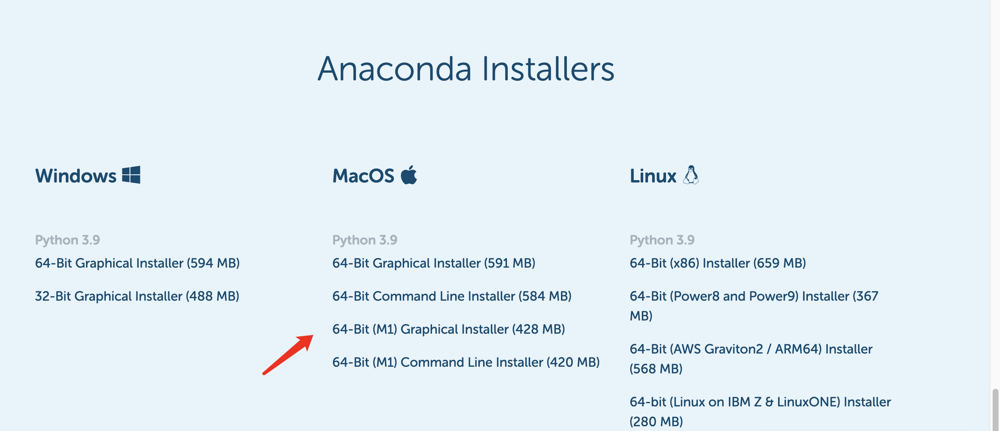

# ❤ 准备事项

### Python安装

前往Python官网下载最新版本的Python，链接🔗：[https://www.python.org/](https://www.python.org/)

.png>)

然后，打开终端输入命令`python`来检查python是否安装成功：

.png>)

### Pycharm安装

PyCharm是Python开发最常用的[IDE](https://en.wikipedia.org/wiki/Integrated\_development\_environment)，分为免费版本和付费的专业版，这里使用免费的即可。下载链接🔗：[https://www.jetbrains.com/zh-cn/pycharm/download/#section=mac](https://www.jetbrains.com/zh-cn/pycharm/download/#section=mac)

.png>)

### Anaconda & Jupyter notebook安装

Anaconda为Python数据分析提供了一个一体化的环境，包含了众多常用的Python数据分析需要使用到的包。链接🔗：[https://www.anaconda.com/products/distribution#Downloads](https://www.anaconda.com/products/distribution#Downloads)

而Jupyter notebook为使用者提供了一个交互性更强的环境。在anaconda安装好之后，就可以打开Anaconda Navigator 图形化界面，然后找到notebook来安装。安装后尝试启动它，如果在本地浏览器可以成功自动打开，则安装成功。

### 参考资料

<mark style="color:red;">工欲善其事，必先利其器。</mark>

1. [Python官方文档](https://docs.python.org/3/)；
2. [Python代码运行可视化](https://pythontutor.com/visualize.html#mode=edit)，适合初学者研究问题使用；
3. Google & Wikipedia & [Stackoverflow](https://stackoverflow.com/)；
4. 分享的PDF &  ipynb文件；

